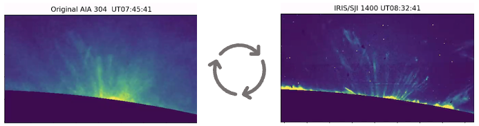

# CycleGAN for coronal rain tracking  
In order to properly estimate the prevalence of TNE / thermal instability over active regions we are training a CycleGAN on an unpaired image-to-image translation task.

Although NASAs SDO satellite monitors the entire solar disk, its AIA 304 channel includes a hot component from Si XI 304.3 which contaminates the image with diffuse coronal emission. On the other hand, NASAs IRIS satellite does not see the entire solar disk (only small patches), however, its passband is tight enough such that this unwanted stray light contamination is not present, making it easier to track cool dense downflowing material. 

**Figure 1** — Using CycleGAN to translate between image domains (AIA left IRIS right). 